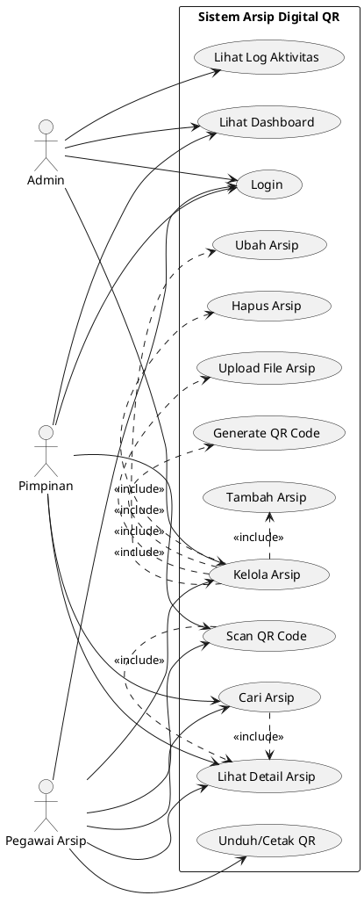
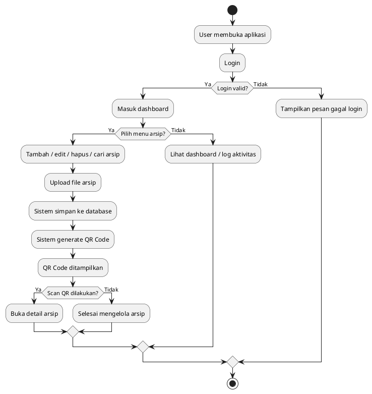
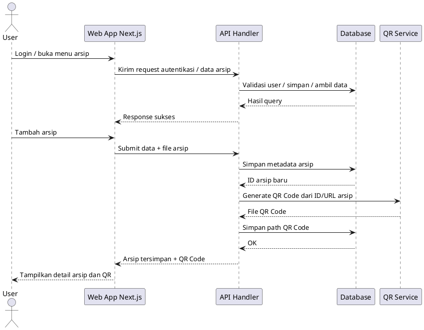
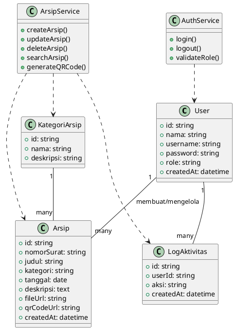

# Product Requirements Document (PRD)

## 1. Ringkasan Produk

**Nama Produk:** Sistem Arsip Digital Berbasis Web dengan Fitur Pencarian QR Code

**Instansi:** Kantor Kecamatan Balaraja

**Tujuan Produk:**
Membangun sistem arsip digital berbasis web untuk menggantikan proses pengarsipan manual, mempercepat pencarian dokumen, dan mempermudah identifikasi arsip melalui QR Code.

**Platform:** Web

**Usulan Teknologi:**

* Next.js (App Router)
* TypeScript
* Tailwind CSS
* shadcn/ui
* PostgreSQL
* Drizzle ORM
* QR Code library
* File storage lokal / cloud storage

---

## 2. Latar Belakang Masalah

Pengelolaan arsip manual pada kantor pemerintahan cenderung lambat, boros ruang, dan rawan kehilangan dokumen. Proses pencarian dokumen memerlukan waktu karena pegawai harus membuka arsip satu per satu secara fisik. Sistem digital diperlukan agar arsip dapat disimpan secara terstruktur, dicari lebih cepat, dan diberi identitas unik melalui QR Code.

---

## 3. Tujuan Produk

1. Menyediakan sistem penyimpanan arsip berbasis web.
2. Mempercepat pencarian dokumen arsip.
3. Memberikan identitas unik pada setiap arsip melalui QR Code.
4. Menyediakan manajemen data arsip yang lebih rapi, aman, dan terstruktur.
5. Menyediakan akses berdasarkan hak pengguna.

---

## 4. Ruang Lingkup Produk

### Dalam Ruang Lingkup

* Login pengguna
* Manajemen data arsip
* Upload file arsip
* Generate QR Code untuk tiap arsip
* Scan QR Code untuk membuka detail arsip
* Pencarian arsip
* Filter arsip
* Cetak / unduh QR Code
* Dashboard ringkasan data
* Logging aktivitas dasar

### Di Luar Ruang Lingkup

* OCR isi dokumen
* Tanda tangan digital
* Workflow disposisi surat
* Notifikasi WhatsApp/Telegram
* Enkripsi tingkat lanjut di luar standar aplikasi web biasa
* Integrasi lintas instansi

---

## 5. Stakeholder dan User Persona

### Stakeholder

* Pegawai arsip
* Admin sistem
* Pimpinan / pejabat terkait

### Persona 1: Admin

Mengelola semua data arsip, pengguna, dan konfigurasi sistem.

### Persona 2: Pegawai Arsip

Menginput arsip, mengunggah file, dan melakukan pencarian arsip.

### Persona 3: Pimpinan

Melihat data arsip dan membuka dokumen melalui hasil pencarian atau QR Code.

---

## 6. Kebutuhan Fungsional

### 6.1 Autentikasi

* Sistem harus menyediakan login dan logout.
* Sistem harus membedakan hak akses berdasarkan role.

### 6.2 Manajemen Arsip

* Sistem harus memungkinkan pengguna menambah arsip baru.
* Sistem harus memungkinkan pengguna mengubah data arsip.
* Sistem harus memungkinkan pengguna menghapus arsip.
* Sistem harus menampilkan daftar arsip.

### 6.3 Upload Dokumen

* Sistem harus menerima file dokumen arsip.
* Sistem harus menyimpan metadata arsip ke database.

### 6.4 QR Code

* Sistem harus membuat QR Code otomatis untuk setiap arsip.
* Sistem harus menyimpan data QR Code yang terhubung ke arsip.
* Sistem harus menampilkan QR Code pada halaman detail arsip.
* Sistem harus menyediakan unduh / cetak QR Code.

### 6.5 Pencarian dan Filter

* Sistem harus menyediakan pencarian berdasarkan nomor surat, judul, kategori, dan tanggal.
* Sistem harus menyediakan filter data arsip.

### 6.6 Scan QR Code

* Sistem harus dapat membuka detail arsip melalui hasil scan QR Code.

### 6.7 Dashboard

* Sistem harus menampilkan jumlah arsip.
* Sistem harus menampilkan ringkasan surat masuk, surat keluar, dan dokumen lainnya.

### 6.8 Log Aktivitas

* Sistem harus merekam aktivitas utama pengguna.

---

## 7. Kebutuhan Nonfungsional

### 7.1 Usability

* Antarmuka harus mudah digunakan oleh pegawai non-teknis.
* Tampilan harus responsif di desktop dan mobile.

### 7.2 Performance

* Pencarian arsip harus berjalan cepat.
* Proses generate QR Code harus berlangsung otomatis dan singkat.

### 7.3 Security

* Sistem harus menggunakan autentikasi berbasis session / token.
* Pengguna hanya dapat mengakses fitur sesuai role.

### 7.4 Reliability

* Data arsip harus tersimpan konsisten di database.
* Sistem harus menghindari duplikasi data arsip.

### 7.5 Maintainability

* Struktur kode harus modular.
* Komponen UI dan logika backend harus mudah dikembangkan.

---

## 8. Aturan Bisnis

1. Satu arsip memiliki satu QR Code unik.
2. QR Code mengarah ke halaman detail arsip.
3. Hanya pengguna yang memiliki akses yang dapat mengelola data arsip.
4. File arsip wajib memiliki metadata utama.
5. Arsip yang dihapus sebaiknya disediakan mekanisme soft delete agar data dapat dipulihkan.

---

## 9. Fitur Utama Produk

### 9.1 Dashboard

Menampilkan ringkasan data arsip dan aktivitas sistem.

### 9.2 Manajemen Arsip

CRUD data arsip beserta upload file.

### 9.3 Generate QR Code

Membuat kode unik untuk arsip yang tersimpan.

### 9.4 Scan QR Code

Membuka data arsip secara cepat melalui kamera atau pemindai.

### 9.5 Pencarian Cepat

Mencari arsip berdasarkan metadata.

---

## 10. Data yang Dikelola

### Data Master

* User
* Role
* Kategori arsip

### Data Transaksi

* Arsip
* File dokumen
* QR Code
* Log aktivitas

---

## 11. Struktur Halaman

* Halaman Login
* Dashboard
* Daftar Arsip
* Tambah Arsip
* Detail Arsip
* Edit Arsip
* Scan QR Code
* Manajemen User
* Log Aktivitas
* Laporan / rekap sederhana

---

## 12. Rekomendasi Teknologi Implementasi

### Frontend

* Next.js App Router
* TypeScript
* Tailwind CSS
* shadcn/ui

### Backend

* Next.js Route Handler / Server Actions
* Authentication middleware

### Database

* PostgreSQL
* Drizzle ORM

### QR Code

* Library generator QR Code
* Library scanner berbasis browser

### Storage

* Cloud storage atau local storage untuk file arsip

---

## 13. User Flow Utama

1. User login ke sistem.
2. User membuka menu arsip.
3. User menambahkan arsip baru.
4. Sistem menyimpan data arsip ke database.
5. Sistem menghasilkan QR Code unik.
6. User mencetak atau mengunduh QR Code.
7. QR Code ditempel pada arsip fisik.
8. Saat dipindai, sistem membuka detail arsip.

---

## 14. Indikator Keberhasilan

* Proses pencarian arsip lebih cepat dibanding sistem manual.
* Dokumen memiliki identitas unik melalui QR Code.
* Pegawai dapat mengelola arsip secara lebih terstruktur.
* Sistem dapat digunakan secara stabil dan mudah dipahami.

---

# 15. UML Usulan

## 15.1 Use Case Diagram

## 15.2 Activity Diagram

## 15.3 Sequence Diagram

## 15.4 Class Diagram

---

## 16. Catatan Implementasi untuk Next.js

Agar PRD ini mudah diwujudkan dalam Next.js, struktur implementasi yang disarankan adalah:

* `app/(auth)/login`
* `app/dashboard`
* `app/arsip`
* `app/arsip/[id]`
* `app/scan`
* `app/admin/users`
* `app/logs`
* `app/api/arsip`
* `app/api/qr`
* `app/api/auth`

---

## 17. Kesimpulan

Produk yang dirancang adalah sistem arsip digital berbasis web dengan fitur pencarian QR Code untuk mendukung pengelolaan arsip di Kantor Kecamatan Balaraja. Sistem ini berfokus pada digitalisasi arsip, pencarian cepat, dan identifikasi dokumen melalui QR Code. Dengan implementasi Next.js, sistem dapat dikembangkan secara modern, responsif, dan mudah dipelihara.
